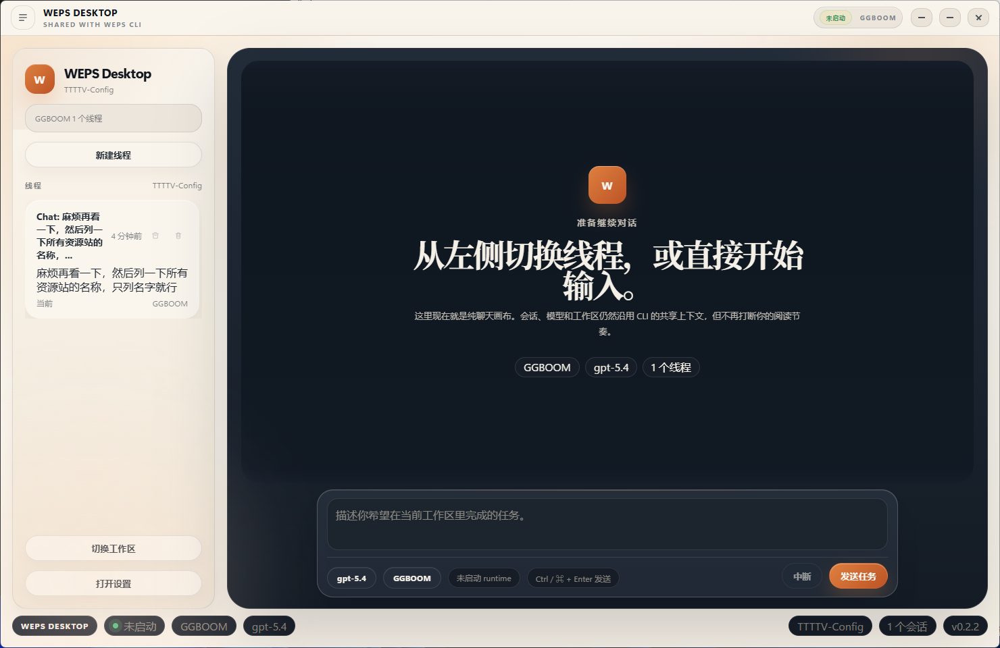
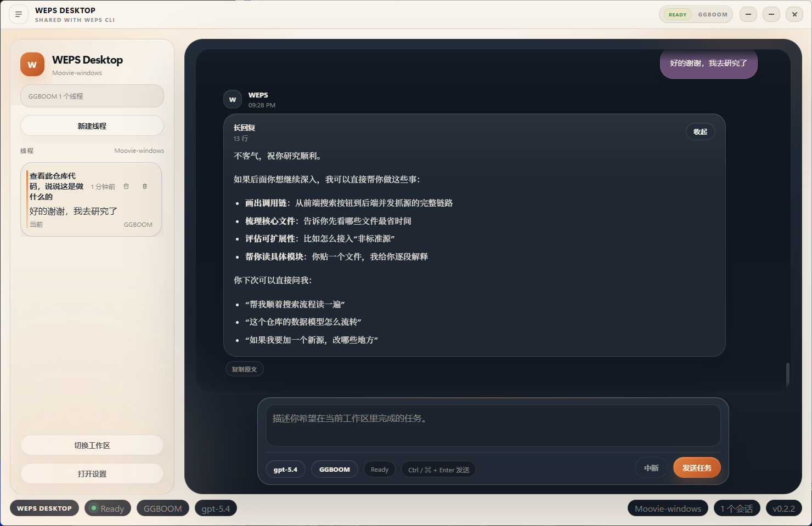
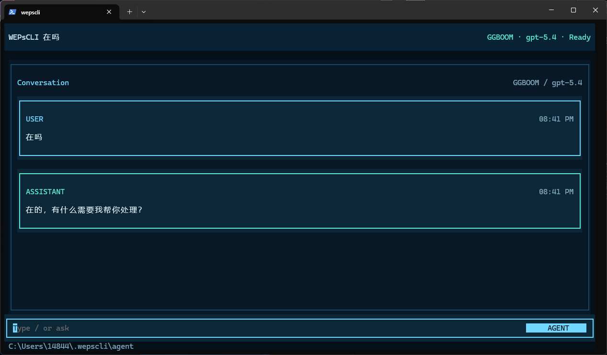
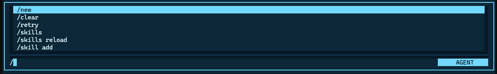
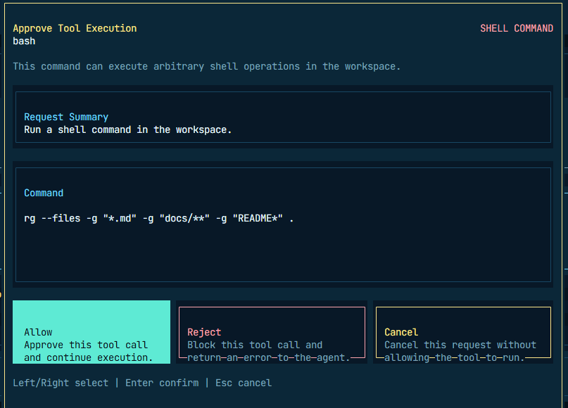
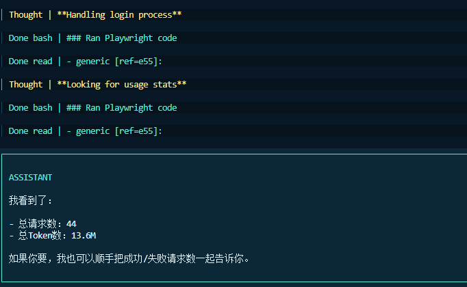

# WEPsCodingCLI

> 这是一个围绕 `wepscli` 与 `wepsdesktop` 持续演进的 coding agent 工作区。  
> 目标是创造一个属于自己的全生态coding agent，有cli、有app、甚至外接社交工具。


## 项目概览

`WEPsCodingCLI` 不是单一 package，而是一个以 `agents-core/packages/wepscli` 为核心、同时配套 `wepsdesktop` 的研发工作区。

当前方向可以概括为：

- `TUI-first`：优先打磨终端内的 coding agent CLI 体验
- `Desktop-second`：为共享会话和工作区提供更自然的桌面交互壳
- `Runtime-shared`：让 CLI 与 Desktop 共用同一套 session、provider、审批与 runtime 数据

## 界面展示

### Desktop（Beta）

更偏“工作台”的桌面体验，适合查看长回复、切换线程和管理 Provider / Workspace。

<p align="center">
  
</p>

<p align="center">
  
</p>

### CLI / TUI （正式）

终端侧强调低摩擦、可中断、可审批、适合持续工作的 agent 交互。

<table>
  <tr>
    <td width="50%">
      
    </td>
    <td width="50%">
      
    </td>
  </tr>
  <tr>
    <td width="50%">
      
    </td>
    <td width="50%">
      
    </td>
  </tr>
</table>

## 仓库结构

```text
WEPsCodingCLI/
├─ agents-core/
│  └─ packages/
│    ├─ agent/
│    ├─ ai/
│    ├─ coding-agent/
│    ├─ wepscli/
│    └─ wepsdesktop/
├─ docs/
├─ imgs/
├─ TODO.md
├─ TODO2.md
├─ LICENSE
└─ readme.md
```

关键目录说明：

- `agents-core/`
  基于 `pi` monorepo 的共享能力层，包含 `ai`、`agent`、`coding-agent`、`wepscli` 等 package。
- `agents-core/packages/wepscli/`
  当前主开发目标，新的 WEPSCLI TUI 壳与运行时接线集中在这里。
- `agents-core/packages/wepsdesktop/`
  Electron 桌面端壳，用于承接共享会话、工作区与更强的可视化交互。
- `docs/`
  项目文档目录。
- `TODO.md` / `TODO2.md`
  当前路线图与阶段性任务记录。

## 快速体验

项目已发布到 npm，可以直接全局安装：

```powershell
npm install -g wepscli
```

安装后可先确认版本与命令入口：

```powershell
wepscli --help
wepscli --version
```

启动并快速体验：

```powershell
wepscli
```

卸载：

```powershell
npm uninstall -g wepscli
```

如果需要完全清除本地使用痕迹，请删除本地状态目录：

```powershell
%USERPROFILE%\.wepscli
```

注意：删除后会丢失会话内容与本地状态。

## 当前进度

请直接查看 [TODO.md](./TODO.md)、[TODO2.md](./TODO.md)。

## 本地开发

建议环境：

- Node.js 20+
- npm
- Windows PowerShell

### 安装依赖

```powershell
cd D:\WEPsCodingCLI\agents-core
npm install
```

### 构建共享工作区

```powershell
cd D:\WEPsCodingCLI\agents-core
npm run build
```

### 运行 WEPSCLI

```powershell
cd D:\WEPsCodingCLI\agents-core\packages\wepscli
npm run shell
```

### 单独检查 / 构建 wepscli

```powershell
cd D:\WEPsCodingCLI\agents-core\packages\wepscli
node ./scripts/build.mjs
npx tsc -p tsconfig.build.json --noEmit
```

### 启动与构建桌面端

```powershell
cd D:\WEPsCodingCLI\agents-core\packages\wepsdesktop
npm install
npm run build
npm run dev
npm run pack:win
```

## 仓库说明

- 这个仓库包含实验目录、共享 runtime、桌面壳与 CLI 壳，不只是最终产品代码。
- `wepscli` 是当前主要定制开发点，`wepsdesktop` 负责补全图形化工作流。


## 致谢

- 本项目的共享基础能力与部分结构来源于 [badlogic/pi-mono](https://github.com/badlogic/pi-mono)。
- `agents-core/` 中保留了对应上游代码与许可证信息，详见 `agents-core/LICENSE`。

## 许可证

MIT License
